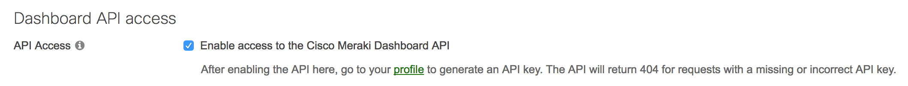

# Meraki AP SSID Cryptocurrency Ticker

Ever wanted BTC or ETH prices available at a moment's notice from any WiFi enabled device? Look no further!

This application uses the Cisco Meraki cloud APIs to set the SSID of a wireless network you control to the current BTC and/or ETH price with their current upward or downward trend calculated hourly.

## Configuration

First of all you obviously need control of a Meraki network with at least one active access point. This guide assumes you have knowledge of the Meraki cloud dashboard. It won't teach you how to create new SSIDs or any of that junk. That in mind, here are the steps to configuring the application to do our bidding:

1. Enable the Merkai API at the bottom of the **Organization > Settings** Page.


2. Generate an API key on the **Edit Account** Page


3. Create a new SSID under the **Wireless > SSIDs** Page. Name it whatever you want, it'll be renamed promptly by the application. Ensure it's secured properly and implement any firewall rules and traffic shaping as you see fit. This network shouldn't have any devices connect to it ever, so just fire and forget some obnoxiously long PSK.
4. At this point you need to hit the API to get your Organization ID and your Network ID. Get the organization ID with this query. Be sure to fill in your API key header:

```bash
curl -L -H 'X-Cisco-Meraki-API-Key: <key>' -X GET -H 'Content-Type: application/json' 'https://api.meraki.com/api/v0/organizations'
```

5. It'll returns something like this, note the id in each object is what we're after:

```json
[
  {
    "id":1234,
    "name":"My org"
  }
]
```

6. Use the organization ID you just pulled to find the network ID of the network that contains the SSID you're using for the ticker. Be sure you fill in the API key and organization ID before running the command:

```bash
curl -L -H 'X-Cisco-Meraki-API-Key: <key>' -X GET -H 'Content-Type: application/json' 'https://api.meraki.com/api/v0/organizations/[organizationId]
```

7. It'll return something like this, note the id in each object is what we're after:

```json
[
  {
    "id":"N_1234",
    "organizationId":"1234",
    "type": "wireless",
    "name":"My network",
    "timeZone": "US/Pacific",
    "tags": null
  }
]
```

8. Now you'll need to find the SSID number of the SSID that'll act as the ticker. This one's easy. Just go in and edit the SSID's settings and the number will be in the last part of the URL as shown here:


9. At this point we have the information to allow the application to do its business. Take your Meraki API key and the NetworkID and SSID number we gathered and store them in the config.json as such:

```json
{
    "apikey": "API_KEY_HERE",
    "networkid": "NETWORK_ID_HERE",
    "ssidnum": "SSID_NUMBER_HERE",
    ...
}
```

10. Enable the cryptocurrencies you'd like to see using the other configuration options in config.json, setting them to true as shown here:

```json
{
    "apikey": "API_KEY_HERE",
    "networkid": "NETWORK_ID_HERE",
    "ssidnum": "SSID_NUMBER_HERE",
    "btc": true,
    "eth": true,
    ...
}
```

11. We're home free! Just build the application using **tools/build-(platform).sh** and run the application using **./build/ticker**

12. Within seconds you should see the SSID set to the current crypto prices that you have enabled formatted like this:

```text
BOTH Enabled:

[BTC ↑ $13.4k] [ETH ↑ $481]

Only one enabled:

(BTC) ↑ $13,416 [+7.4%]
or
(ETH) ↑ $481 [+9.1%]
```


## Information

By default the application updates the prices once every five minutes. This can be changed using the *interval* configuration option. The value is set in minutes.
